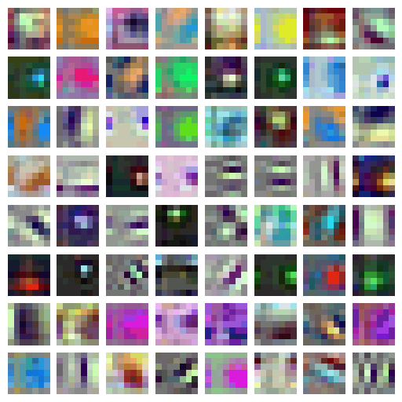

# Cross-D Conv: Cross-Dimensional Knowledge Transfer via Fourier Shifting

A novel approach for bridging 2D and 3D medical imaging analysis through cross-dimensional convolution operations.

## Overview

Cross-D Conv introduces a method that enables seamless weight transfer between 2D and 3D convolution operations through Fourier domain phase shifting. This solution addresses the common challenge in biomedical imaging where 3D data, while more applicable, is scarce compared to abundant 2D samples.

## Key Features

- Cross-dimensional weight transfer between 2D and 3D convolutions
- Fourier domain phase shifting for dimensional adaptation
- Enhanced 3D model performance using 2D training data
- Efficient classification and segmentation for medical imaging

## Usage

To train the model using distributed training:

```bash
torchrun --nproc_per_node=16 --standalone train.py \
    --data-path /path/to/radimagenet \
    --workers 16 \
    --batch-size 32 \
    --sync-bn \
    --rot
```

## Performance

The model achieves state-of-the-art performance in cross-dimensional medical image analysis, demonstrating superior feature quality assessment compared to conventional methods.

## Citation

If you use this code in your research, please cite:

```bibtex
@article{yavuz2024cross,
  title={Cross-D Conv: Cross-Dimensional Transferable Knowledge Base via Fourier Shifting Operation},
  author={Yavuz, Mehmet Can and Yang, Yang},
  journal={arXiv preprint arXiv:2411.02441},
  year={2024}
}
```



## License

This project is licensed under the MIT License.
